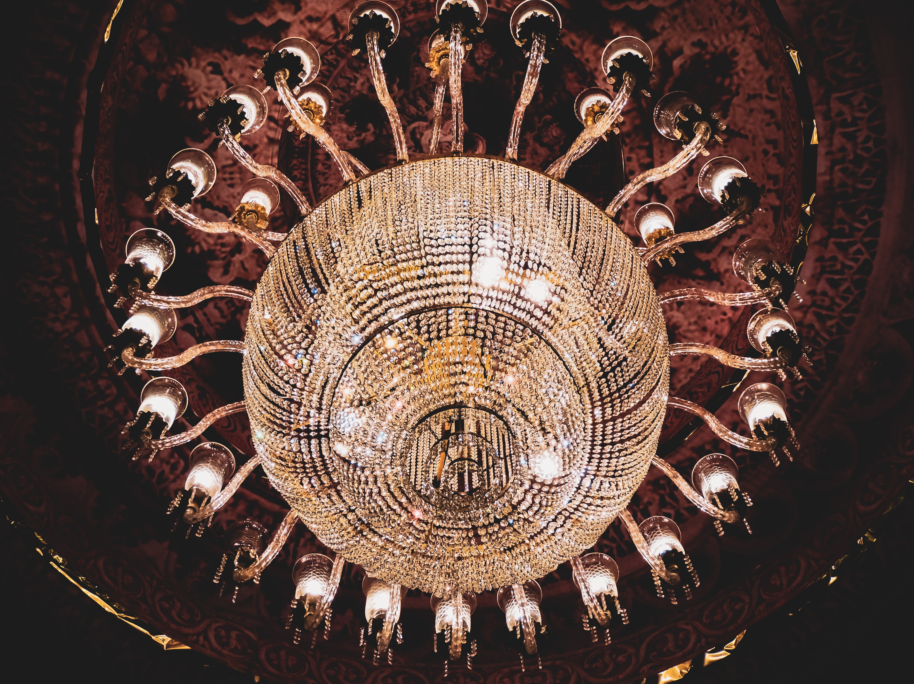

Ánh sáng đèn chùm của phòng khách cực kì quan trọng trong việc trang trí nội thất căn phòng. Ngoài những công năng trang trí ánh sáng thông thường, đèn chùm còn góp phần tôn lên vẻ đẹp sang trọng, ấm cúng cho căn phòng khách của bạn, đặc biệt là phòng khách của những mẫu biệt thự đẹp. Vì thế, chúng tôi xin giới thiệu cách chọn đèn chùm phòng khách để đảm bảo được vẻ đẹp sinh động cho ngôi nhà của bạn.  

Để tạo ra một không gian ấm áp với nguồn ánh sáng dịu nhẹ, lan tỏa bạn cần treo một chiếc đèn chùm trang trí đảm bảo cường độ ánh sáng vừa phải. Bên cạnh đó, tone màu của đèn và kiểu dáng phải đảm bảo phù hợp với không gian phòng khách, kích thước phòng và cách bài trí nội thất. Người ta thường chọn đèn chùm có tone màu vàng để mang lại cảm giác ấm áp, dịu dàng và không hại mắt. Hiện nay đèn chùm có vô số kiểu dáng khác nhau, phong cách khác nhau nên cách chọn đèn chùm phòng khách rất quan trọng và cần chú ý. 

Đèn chùm trở thành vật dụng không thể thiếu trong những phòng khách sang trọng, đặc biệt là nhà phong cách cổ điển 

## Lưu ý cách chọn đèn chùm phòng khách cổ điển với kiểu dáng, kích thước phù hợp nhất 

Mang một vẻ đẹp lộng lẫy, diễm lệ, tinh tế nhưng vẫn giữ được nét đặc trưng riêng, đèn chùm là một loại đèn đặc biệt, có kích thước lớn, được cấu tạo và trang trí cầu kì, thường từ 2 đến 3 tầng khác nhau, là tập hợp của nhiều bóng hay các dụng cụ chiếu sáng. Giá trị của đèn chùm cũng không rẻ vì việc sản xuất và thiết kế cầu kì của nó. Chính vì sự đa dạng, phức tạp của nó mà khi sử dụng đèn chùm trang trí, người sử dụng phải cân nhắc rất nhiều về cách chọn đèn chùm phòng khách, cân nhắc về kiểu dáng và kích thước đèn để phù hợp nhất với không gian phòng khách. 

## Cách chọn đèn chùm phòng khách quan trọng nhất là kiểu dáng và màu sắc 

Đối với một phòng khách cổ điển, chúng ta cũng nên chọn một kiểu đèn chùm cổ điển với hình dáng tinh xảo, tỉ mỉ và mềm mại để hòa quyện, phù hợp với những đường nét nội thất của phong cách mẫu biệt thự cổ điển, nếu không chú ý tới yếu tố này, sẽ xảy ra tình trạng khập khiễng, có thể: không gian đẹp + đèn đẹp = tổng thể phòng khách xấu. Hiện nay có rất nhiều loại đèn cổ điển cao cấp với hình dáng đẹp mắt mà ai cũng ao ước được cấu tạo từ những vật liệu tốt nhất trên thị trường và mang lại sự sang trọng, đẳng cấp cho căn phòng cổ điển.  

Đèn chùm cổ điển luôn tinh xảo và hoa lệ, đôi khi pha chút huyền bí  phù hợp với những mẫu biệt thự kiểu Pháp đẹp 

Mẫu đèn chùm cổ điển 1 tầng 4 bóng mang đến sự ấm cúng, độc đáo khi thay đổi máu sắc bóng đèn. Mẫu đèn này phù hợp với kiến trúc Á Đông cổ điển tạo nên cảm giác xưa cũ nhưng tinh tế, độc đáo và đẹp mắt. Cách chọn đèn chùm phòng kháchnhư kiểu đèn này phù hợp với những kiểu phòng có màu nội thất chủ đạo tương tự 

 Đèn sắt cổ điển mỹ thuật ngày nay được ưa chuộng và nhiều người yêu thích bởi vẻ đẹp nghệ thuật và tính thẩm mĩ cao, làm cho ngôi nhà thêm sang trọng, lung lin

Đèn chùm mỹ thuật gắn nến đậm màu sắc cổ điển sẽ giúp phòng khách thêm lung linh, thanh tĩnh và sang trọng, là lựa chọn tối ưu về cách chọn đèn chùm phòng khách cổ điển.  

Về kích thước, cũng như tất cả các yếu tố khác của kiến trúc nội thất của phòng khách, đèn chùm cổ điển cần phải hài hòa về kích thước, đó là nhân tố quan trọng nhất của tính thẩm mĩ. Một chiếc đèn dù đẹp đến mấy mà tỉ lệ không phù hợp thì cũng không thể làm không gian đẹp hơn. Ví dụ như diện tích nhỏ, trần thấp, mà đèn lớn sẽ gây bức bối, khó chịu. Để chọn kích thước đèn phù hợp, chúng ta có thể áp dụng công thức sau: 

Gọi L là độ dài của đèn chùm, H là chiều cao trần nhà 

Nếu H khoảng  = 3m, thì L = 1/5H. 

Nếu H > 3m thì L = 1/4H 

Với H < 3m thì không nên sử dụng đèn cổ điển vì đèn cổ điển khá bề thế và rộng, có nhiều tầng.   

## Cách chọn đèn chùm phòng khách cần lưu ý màu sắc và ánh sáng của đèn chùm phù hợp không gian cổ điển  

Cách chọn đèn chùm phòng khách cổ điển không hề dễ dàng, đặc biệt là khi chọn màu sắc của đèn. Người ta thường chọn đèn có ánh sáng màu trắng và màu vàng để phù hợp với không gian phòng khách cổ điển, vì nó tạo nên sự trang nhã hoặc ấm cúng, sang trọng, huyền bí. 

Xét về màu sắc bên ngoài chiếc đèn chùm, đa số là sự kết hợp giữa các vật liệu như pha lê trắng, tím, màu đen của sắt, màu nâu trầm… nên vô cùng khó chọn màu. Nếu con mắt thẩm mĩ của chúng ta không được tốt thì hãy căn cứ vào màu cơ bản của vật dụng xung quanh, màu chủ đạo của tường nhà, của các đồ nội thất. Ví dụ như màu sơn nhà là gam trầm và bộ sofa sang trọng màu nâu thì hãy chọn một đèn chùm cổ điển có màu sắc chủ đạo bên ngoài màu nâu và ánh sáng màu trắng.  

Nếu màu chủ đạo của căn phòng là màu vàng, chúng ta sẽ chọn đèn chùm vàng và ánh sáng vàng nhẹ nhàng, dịu êm.  

Cách chọn vị trí treo đèn chùm phù hợp với không gian phòng khách cổ điển    

Định vị chùm đèn (quan hệ vị trí đèn với các bề mặt tương ứng trong không gian, đặc biệt là trần và sàn nhà: Nên treo đèn ở vị trí thẳng với vị trí của bàn uống nước và đặt ở giữa trần nhà để tạo điểm nhấn cho ngôi nhà. Vì bàn uống nước là khoảng trống không có sự xuất hiện của con người nên rất hợp lí, tránh treo ở vị trí thẳng với ghế ngồi. 

## Cách chọn đèn chùm phòng khách cổ điển với giá cả phù hợp túi tiền khách hàng 

Giá cả của đèn chùm cổ điển tương đối đắt nhưng cũng phân hóa đa dạng. Những loại đèn cao cấp giá thường trên 15 triệu đồng vì chi tiết phức tạp, bề thế và chất liệu tốt hơn, thường thì phụ thuộc vào độ khó và chất liệu vật liệu. Ví dụ như đèn đồng chao đá bóng nến, đèn pha lê, đèn chao đá cao cấp… còn những loại đèn bình thường giá chỉ khoảng từ 2 triệu đồng đến 10 triệu đồng, những loại đèn sắt thường trên 5 triệu đồng. Cách chọn đèn chùm phòng khách cổ điển còn tùy thuộc vào điều kiện tài chính của mỗi gia đình và sự thay đổi giá cả trên thị trường.  

Đèn chùm cổ điển pha lê cao cấp được mệnh danh là nữ hoàng của các loại đèn chùm  

Đèn chùm cổ điển đương tay thổi thủy tinh  

Những kiểu đèn chùm sắt mỹ thuật tỉ mỉ, phức tạp hơn cũng có giá khá cao, tầm trên 10 triệu đến loại mấy chục triệu, hiện nay đèn chùm sắt mỹ thuật cổ điển rất được ưa chuộng. 

Đèn chùm sắt mỹ thuật đẳng cấp quý phái, tinh tế và đậm dấu ấn cổ điển huyền bí giành cho những gia chủ có niềm đam mê với đèn chùm.  

Cách chọn đèn chùm phòng khách kiểu cổ điển không phải là điều dễ dàng vì nó liên quan đến cả yếu tố kiến trúc và nội thất, vừa liên quan đến yếu tố nghệ thuật, thẩm mĩ, cả yếu tố phong thủy, vì vậy đòi hỏi khách hàng cần có sự chắc chắn, cẩn trọng để giúp không gian phòng khách gia đình bạn thêm sang trọng, sinh động, hấp dẫn, lôi cuốn. 