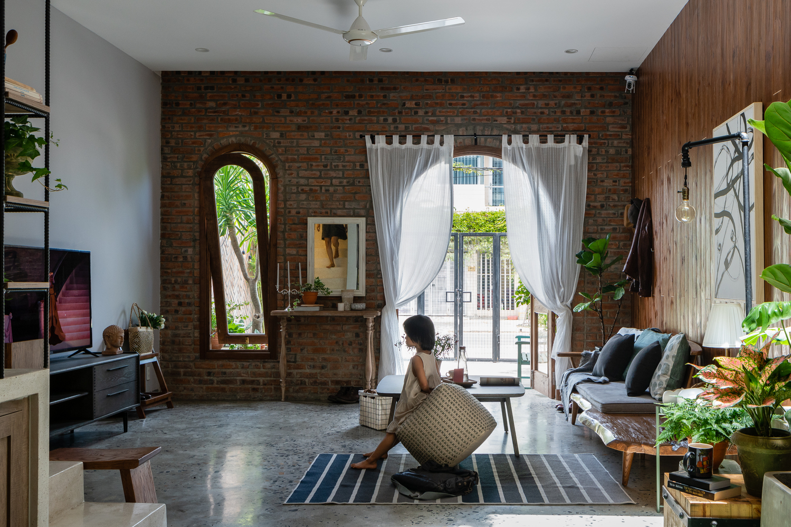
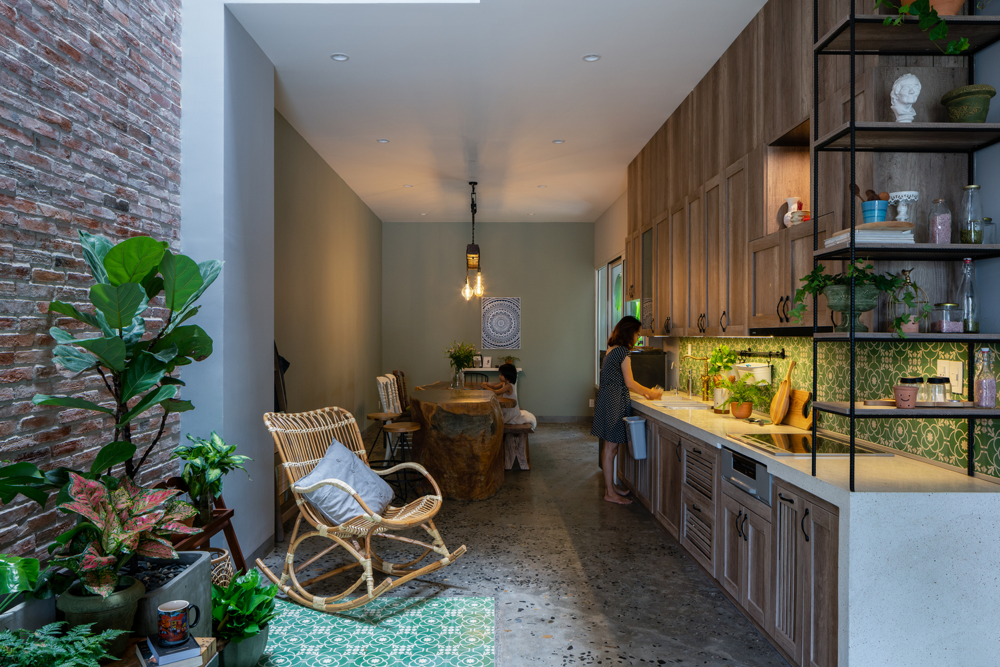
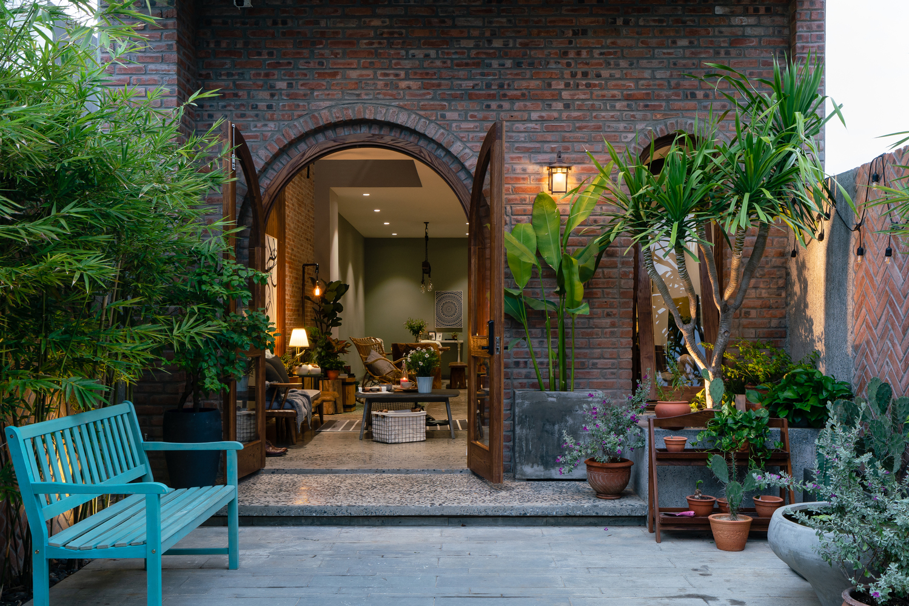
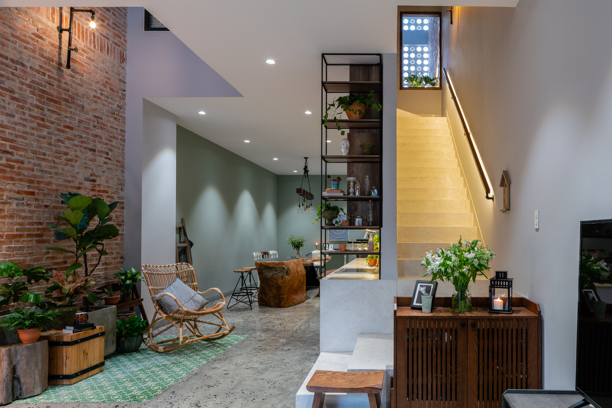
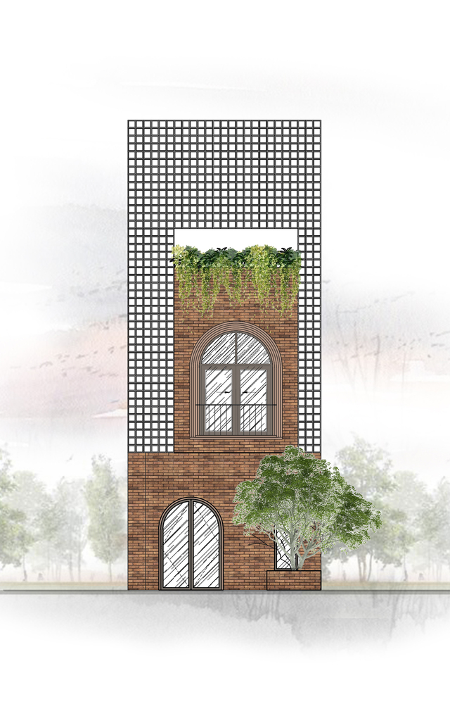
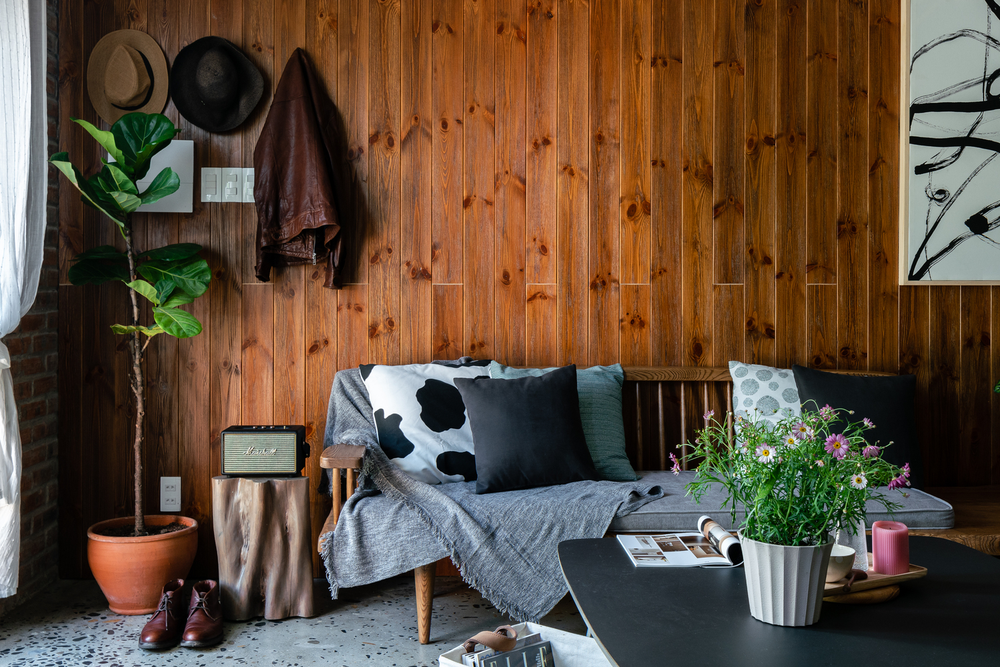
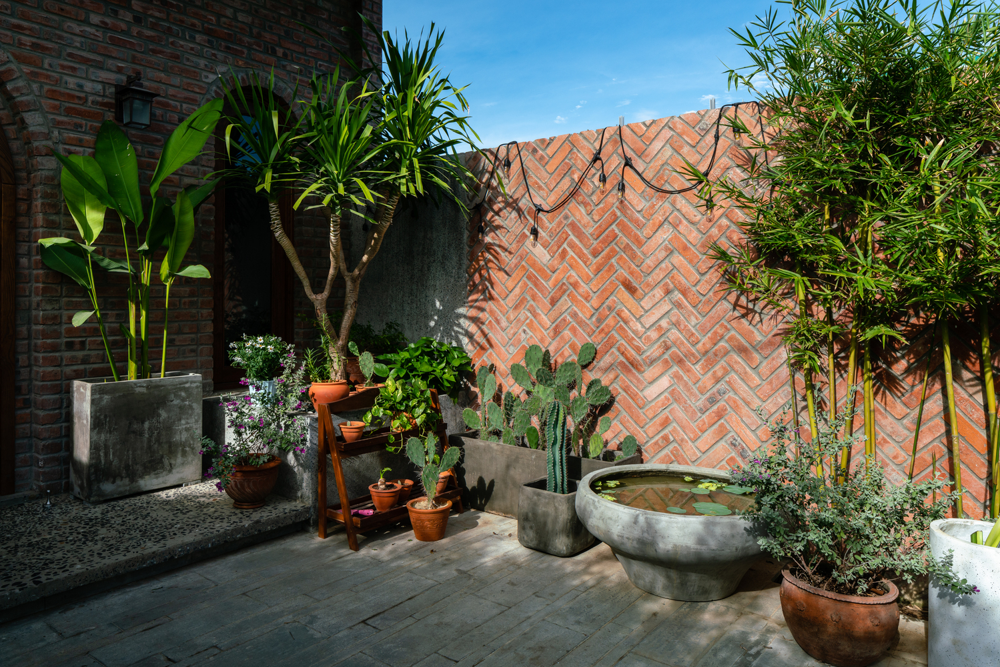
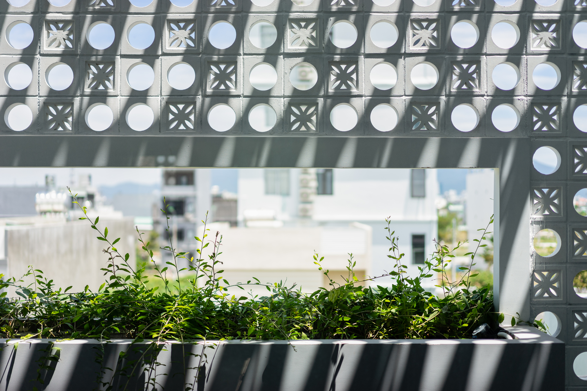

Text description provided by the architects. There is a really rustic, peaceful place in the heart of the bustling city, which is Coi House. A very specific and artistic architecture makes us fascinated at the first sight. The house is located on Mac Dang Dung street, new urban area of Hoa Xuan, Cam Le , Da Nang. Take advantage of being near the river, the architect has refined the design of the doorways and skylights so that the house can always receive natural light and the cool breeze every day.

Watch the rays of light glide through the small wind with a cup of coffee makes your day more meaningful than ever. Entering the gate, a row of green bamboos is planted on the corner, making viewers extremely excited. Each room is a separate structure with rustic, nature design. Aisles, stairs, unique interiors connect space together and bring more comfort.

The living room is quite spacious, exhibited interior with natural wood, in harmony with the green energy of small plants grown by each of the family member. With the desire not only to build a house to live in, but also a place to build love, close friendship and save beautiful moments together.

The kitchen is designed modernly near the airy skylight, with full amenities for the user. The layout of the dining table overlooking a small garden is enough to make family meals become cozy, sweet and closer to nature. The meticulous attention to detail of the countless interior furn

The house is more splendid and attracts all eyes when lighted up at night by the harmonious color. The aesthetics of the house are created by skillful arrangement of hundreds of windflowers, combined with rough walls that bring light into the interior and maximize the view to the outside. With a unique design, an interior close to nature, the house will surely bring you interesting experiences.

